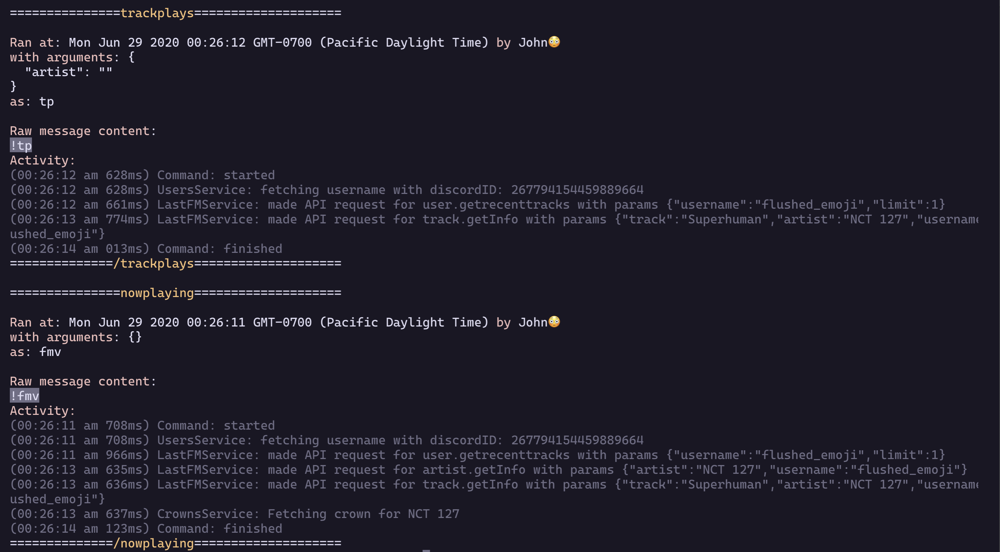

# Gowon

Gowon is a Last.FM discord bot in active development.

Check out the indexing server over at [jivison/mirrorball](https://github.com/jivison/mirrorball)
Check out the website over at [jivison/gowon.ca](https://github.com/jivison/gowon.ca)

## Running yourself

Ensure you have Postgres and Typescript installed, and a database called `gowon` exists (`createdb gowon`).
Ensure you have Redis installed (https://redis.io/download) and started

Rename `config.example.json` to `config.json`, and fill in all the fields. Then, do the same with `ormconfig.example.json`

`yarn start` will build and run the bot. To start in development mode, make sure you have `nodemon` installed, then run:

```sh
yarn build:watch
# and in another tab
yarn start:watch
```

## Logging

Every command run has a log associated with it. This way if multiple commands are run at once, the logs stick to the command they were created by. Below is an example of some logs:



## Commands list

_You can find the source code for all the commands at [/src/commands](/src/commands)_

There are now too many commands to list in the README, see `!help` for a list of all commands.

## Special Thanks

- All my alpha testers, for breaking everything:

  - RTFL
  - Thot
  - Mex ([Go checkout REM](https://github.com/yayuyokitano/REM))
  - DunsterJR
  - Manu
  - Himiko
  - Dana
  - Turbie
  - Itsuko
  - Catchy

- DunsterJR for making the (old) profile picture, and for the friends plays idea
- mypetrobot for building the `Who Knows?` bot, the backbone and inspiration for this bot
- Frikandel, for being a great influence and always ready to help ([Go checkout .fmbot!](https://github.com/fmbot-discord/fmbot))
- Ish, for being cool overall 😎 ([Go checkout Chuu!](https://github.com/ishwi/discordBot))
- Last.fm, for making a great platform <3

## Any questions?

Somethings broken? Just curious how something works?

Feel free to shoot me a Discord dm at `john!#2527`
or join the support server! https://discord.gg/9Vr7Df7TZf
